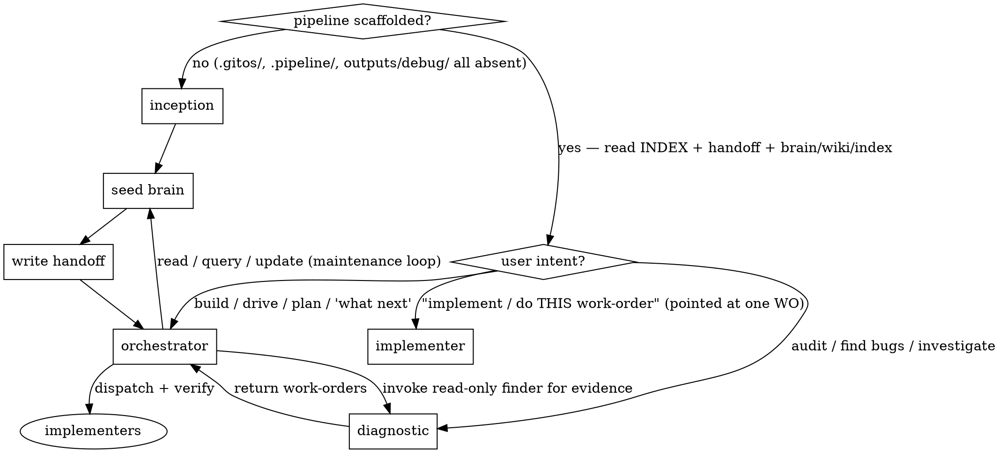

# GitOS

A project operating-system skill. It bootstraps and runs a four-role agent system (three repo-entry roles + an implementer entered on a single work-order)
on any repo, backed by a per-repo **brain** (the orchestrator's memory). SKILL.md is
the **router**: it tells you what mode you're in and which reference to open. All the
detail lives in `references/` — keep this file lean and follow the pointers.

## The roles + the brain

| Mode | When you're in it | Read |
|---|---|---|
| **Inception** | The repo has no pipeline yet — first-time setup | `references/roles/inception.md` |
| **Orchestrator** | A pipeline exists; you're building / driving / deciding *with* the user | `references/roles/orchestrator.md` |
| **Diagnostic** | You're investigating read-only — auditing, finding bugs, cataloging anomalies | `references/roles/diagnostic.md` |
| **Implementer** | You're handed **one work-order** to land — by an orchestrator dispatch *or* by the operator pointing a fresh window at that WO ("implement this", "do `wo_046`") | `references/roles/implementer.md` |

The **brain** (`.gitos/brain/`) is the orchestrator's long-term memory — a
self-contained knowledge vault of typed, cross-linked pages (sources / entities /
concepts / decisions). It's seeded at inception and grown by the orchestrator as it
works. Schema + the maintenance/anti-redundancy protocol: `references/brain-schema.md`.

`references/agent-system.md` is the one-page map of how the roles + the brain
relate. Read it if the picture isn't clear.

## First action: detect state, then route

Whatever the user said, resolve it to exactly one mode by detecting whether the repo
is initialized. This is the single entry point — "start working on this repo" always
lands somewhere.



Detection procedure (deterministic, in order):
1. `<root>/.gitos/` exists → **initialized**. The home is `.gitos/` (the unified default).
2. else `<root>/.pipeline/` exists → **initialized (legacy home)**. The home is
   `.pipeline/`; everything below works unchanged.
3. else `<root>/outputs/debug/INDEX.md` exists → **initialized (legacy home)**. The
   home is `outputs/debug/`; everything below works unchanged.
4. else a memory pointer exists at `~/.claude/projects/<project-dir>/memory/` named
   `gitos_role_brief.md` **or** the legacy `diagnostic_role_brief.md` → read
   it; it names the home and default role.
5. else → **uninitialized** → Inception.

On an initialized repo, before acting, read `<home>/INDEX.md` (work state),
`<home>/handoff.md` (the birth record, once), and — if a brain exists —
`<home>/brain/wiki/index.md` (knowledge state). Then route on intent.

**Implementer entry — the common "fresh window on a work-order" case.** If the operator points you
at *one specific work-order to execute it* ("implement `wo_046`", "do this WO", a new window opened on
a single work-order file), you are the **Implementer**, not the orchestrator. Do **not** bootstrap the
full orchestrator context or assume you drive the ledger — read **that work-order in full** (plus any
brain page it cites), **plan first → then execute**, edit **only** its `## Proposed fix scope`, and
fill its `## Implementer notes`. The orchestrator is the *persistent* window that coordinates; an
implementer window lands one order and returns. Full brief: `references/roles/implementer.md`.

## Role: Inception (one-time)

Bootstrap an uninitialized repo. Briefly: run a short interview (project identity,
acceptance criteria, hold-out discipline, outcome definition, production target y/n,
predecessor lessons, **brain ingest depth**), run `scripts/scaffold.py` to lay the
`.gitos/` tree + the brain, **seed the brain** at the chosen depth (minimal /
moderate / aggressive), fill `handoff.md`, ensure version control (auto-init git if
absent, after reporting intent), then hand control to the orchestrator in the same
session. It does NOT write application source. Full procedure:
`references/roles/inception.md`.

## Role: Orchestrator (ongoing — the front-line builder)

The agent that builds *with* the user and coordinates the work. Each session it reads
the handoff (once), `INDEX.md`, and the brain. It owns the four INDEX sections + the
work-order lifecycle; authors forward work-orders; invokes the diagnostic finder for
evidence; dispatches + verifies implementer agents; and **stewards the brain via the
maintenance loop** (inline upsert → checkpoint reconcile → `brain_lint.py`), recording
a decision page on every non-trivial choice. It MAY authorize edits (unlike the
read-only diagnostic). Full brief: `references/roles/orchestrator.md`.

## Role: Diagnostic (read-only finder)

Investigate without editing. Three phases: build the log/output **vocabulary** →
**scan** the anomaly families (`references/anomaly-families.md`) → write evidence-first
**work-orders** (`references/work-order-template.md`). Full brief:
`references/roles/diagnostic.md`.

## Role-boundary table

The most important invariant is that *finding* is separated from *fixing* — so the
read-only finder can never be pressured into edits mid-investigation.

| Role | May edit code? | Owns | Read this for the full table |
|---|---|---|---|
| Inception | scaffolds once, then hands off | the initial `.gitos/` + brain | `references/roles/inception.md` |
| Orchestrator | no — dispatches all code edits; writes only markdown/state (stewards the brain) | INDEX lifecycle + brain | `references/roles/orchestrator.md` |
| Diagnostic | **no** — read-only, work-orders only | the vocabulary + open findings | `references/roles/diagnostic.md` |
| Implementer (dispatched) | yes — but only the files its work-order's Proposed fix scope names | its specified edits + the Implementer notes | `references/roles/implementer.md` |

## Severity calibration (shared by diagnostic findings + orchestrator triage)

- **critical** — user-facing safety, data corruption, production-down, money/PHI at risk.
- **high** — silent wrong outputs that drive decisions; broken isolation/security boundaries.
- **medium** — misleading logs, drift between calibration and deployment, latent risk.
- **low** — cosmetics, defensive cleanup.
- **unconfirmed** — anomaly seen but proof needs reproduction the agent can't run; also "needs operator decision".

Severity is about *consequence, not certainty*. Don't inflate to get attention; don't
downgrade to seem reasonable.

## Scaffolding

```
python <SKILL_DIR>/scripts/scaffold.py <PROJECT_ROOT> [--brain {on,off}] [--domain <hint>] [--git {ensure,offer,skip}]
```
Idempotent — fills missing pieces, never overwrites state files. Confirm the detected
project root with the user before running; `--git ensure` (default) reports its intent
then runs `git init` if the repo isn't already under version control (`--git skip` opts
out). Detail: `references/roles/inception.md`.

## Upgrade (bring a repo onto the latest engine)

When the user says **"upgrade this repo's engine"**, **"update the gitos directive"**, or
runs the `upgrade` command, route to `references/upgrade.md`. It is the single, canonical
upgrade procedure: detect the repo's home + stamped `engine_version`, **offer to `git pull` the installed
engine first if it's a git clone** (so the latest is what gets applied), live-read the skill's
`VERSION`, and — if the skill is ahead — direct the orchestrator to adopt the latest
directives, re-point stale pointers, stamp the new version, and record an ADR. It changes
the *directive*, never the folder layout, and is idempotent (no upstream change → no-op).
Downstream products with a domain profile wrap this procedure rather than duplicating it.
The procedure's **Step 0** first classifies the repo: a **Standard** (engine-only) repo
falls straight through steps 1–7; a **Custom** (profiled) repo is routed to its `BRIDGE.md`,
which owns SYNC / PRESERVE / MERGE and then finishes via the same steps. A repo that looks
Custom but has no bridge **halts** — see `references/bridge.md` for the BRIDGE contract and
the `_meta.bridge` pointer convention.

## When the user authorizes fixes / implementers

On "fix bug NNN" or "launch agents for these fixes": dispatch implementer agents,
each reading its work-order in full, scoped to **disjoint files** (different sections
of one file is not safe). When a work-order lists Options, pin which one each agent
uses. Each implementer edits **only what its work-order's Proposed fix scope specifies** —
full role + boundary in `references/roles/implementer.md`. Don't run shared-state-mutating
scripts from an implementer — verification is the operator's. After a fix lands: trust-but-verify (`git diff` / grep / read), move
the work-order to `resolved/`, update `INDEX.md` with the fix reference. The diagnostic
role's read-only invariant snaps back when the fix-scope is exhausted. Tell each
implementer to fill the work-order's **Implementer notes** section on completion; when
it lands, **harvest and adjudicate** those notes — ACCEPT each (route durable facts to
the brain, process lessons into your dispatch, follow-ups into new work-orders) or REJECT
it with a one-line reason.

## Reference index (read on demand)

- `references/roles/{inception,orchestrator,diagnostic}.md` — the three operator-entry role briefs.
- `references/roles/implementer.md` — the dispatched implementer (its boundary's SSOT).
- `references/agent-system.md` — the role + brain map and bridge diagram.
- `references/brain-schema.md` — brain layout, page types, the maintenance/anti-redundancy protocol.
- `references/work-order-template.md` — the `bug_<NNN>` / forward work-order format.
- `references/anomaly-families.md` — the nine anomaly families + per-domain adaptations.
- `references/acceptance-criteria.md` — generic promotion/acceptance gates (project-defined).
- `references/production-handoff-contract.md` — generic production-handoff contract skeleton.
- `references/profiles.md` — how a downstream product layers a domain profile on top of the engine.
- `references/upgrade.md` — the canonical `upgrade` procedure (adopt the latest engine directives).
- `references/bridge.md` — the BRIDGE contract: how a Custom (profiled) repo wraps `upgrade` (SYNC / PRESERVE / MERGE).
- `references/disciplines.md` — the transferable engineering disciplines (the war-stories, with the why).
- `references/glossary.md` — terminology (domain-agnostic).
- `scripts/scaffold.py` — lays the `.gitos/` tree + brain (idempotent).
- `scripts/brain_lint.py` — deterministic brain health/redundancy detector (read-only).
